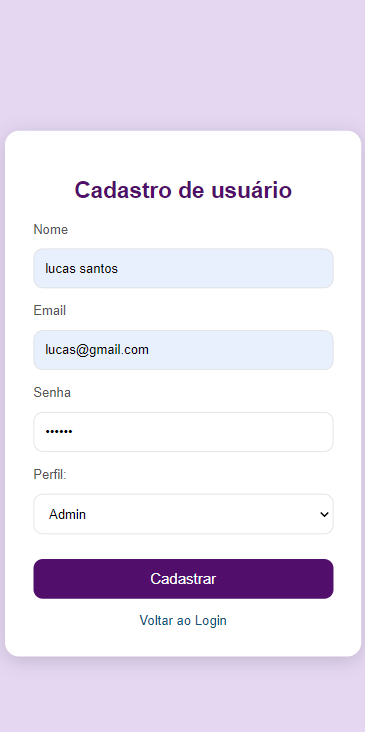
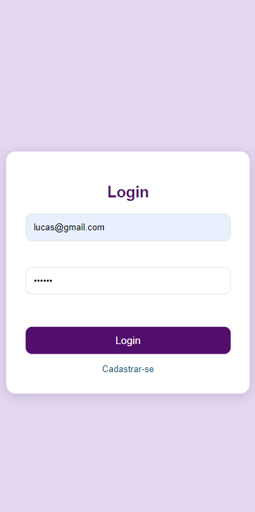

# 🌐 Cadlog System

O **Cadlog System** é um sistema simples e eficaz de cadastro e login, desenvolvido em PHP utilizando a arquitetura **MVC** (Model-View-Controller). Ele foi projetado para facilitar a criação e autenticação de usuários de forma segura.

---

## 🏛️ Arquitetura

O sistema é baseado na arquitetura **MVC**, que organiza a aplicação em três camadas principais:

- **Model**: Gerencia a interação com o banco de dados.
- **View**: Apresenta as interfaces que os usuários interagem.
- **Controller**: Controla as ações entre as Views e os Models.

---

## ⚙️ Funcionalidades

O **Cadlog System** oferece funcionalidades essenciais para o gerenciamento de usuários:

- **Cadastro de Usuários**  
  Registre novos usuários no sistema de maneira simples.  
  

- **Login e Logout**  
  Usuários podem fazer login com suas credenciais e encerrar suas sessões com segurança.  
  

- **Gerenciamento de Sessões**  
  As sessões são gerenciadas automaticamente, garantindo personalização e segurança.  
  

---

## 🌟 Acessos e Permissões

Após o login, o usuário é redirecionado com base no tipo de perfil:

- **Admin**  
  Acesso completo para gerenciar usuários e configurar o sistema.  
  

- **Gestor**  
  Acesso para gerenciar sua equipe e acompanhar tarefas.  
  

- **Colaborador**  
  Acesso limitado para visualizar e atualizar suas tarefas.  
  

---

## 🗄️ Banco de Dados

O sistema utiliza um banco de dados **MySQL** para armazenar as informações dos usuários.  
Arquivo de configuração: `database.sql`.

### Estrutura da Tabela `usuarios`

- **id**: Identificador único.
- **nome**: Nome do usuário.
- **email**: Endereço de e-mail.
- **senha**: Senha (armazenada de forma segura).
- **perfil**: Tipo de usuário (admin, gestor, colaborador).
- **created_at**: Data de criação do registro.

---

## 🛠️ Tecnologias Utilizadas

- **PHP**: Backend do sistema.
- **MySQL**: Banco de dados.
- **HTML/CSS**: Interface do usuário (Views).

---

## ✍️ Feito por

- **Larissa Manrique**  
- Com orientação de **Leonardo Rocha**

