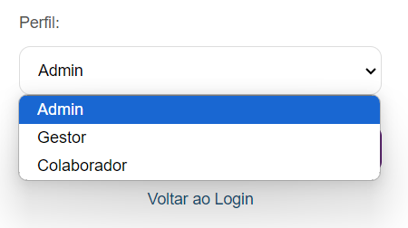

# 🌐 Cadlog System

O **Cadlog System** é um sistema simples e eficaz de cadastro e login, desenvolvido em PHP utilizando a arquitetura **MVC** (Model-View-Controller). Foi projetado para facilitar a criação e autenticação de usuários de forma segura e eficiente, atendendo às necessidades de gerenciamento de acessos em diferentes níveis.

---

## 🏛️ Arquitetura

A aplicação é organizada em três camadas principais:

- **Model**: Gerencia a interação com o banco de dados.
- **View**: Apresenta as interfaces que os usuários interagem.
- **Controller**: Controla as ações entre as Views e os Models.

---

## ⚙️ Funcionalidades

O **Cadlog System** oferece as seguintes funcionalidades essenciais:

  

    <strong>Cadastro de Usuários</strong> 
    Registre novos usuários de forma simples. 
    
  

  

    <strong>Login e Logout</strong> 
    Acesso seguro às contas e encerramento de sessões. 
    
  

  

    <strong>Gerenciamento de Sessões</strong> 
    Controle automático de sessões, garantindo personalização e segurança. 
    
  

---

## 🌟 Acessos e Permissões

Após o login, os usuários são redirecionados com base no seu perfil, que determina os tipos de acesso e permissões disponíveis:

  

    <strong>Admin</strong> 
    <em>Acesso completo</em> 
    Gerencia usuários e configurações. 
    
  

  

    <strong>Gestor</strong> 
    <em>Acesso moderado</em> 
    Gerencia sua equipe e acompanha tarefas. 
    
  

  

    <strong>Colaborador</strong> 
    <em>Acesso limitado</em> 
    Visualiza e atualiza suas próprias tarefas. 
    
  

---

## 🗄️ Banco de Dados

O sistema utiliza um banco de dados **MySQL** para armazenar as informações dos usuários.  
**Arquivo de configuração**: `database.sql`.

### Estrutura da Tabela `usuarios`

| Campo        | Descrição                                   |
|--------------|---------------------------------------------|
| **id**       | Identificador único                         |
| **nome**     | Nome do usuário                             |
| **email**    | Endereço de e-mail                         |
| **senha**    | Senha (armazenada de forma segura)         |
| **perfil**   | Tipo de usuário (admin, gestor, colaborador) |
| **created_at**| Data de criação do registro                |

---

## 🛠️ Tecnologias Utilizadas

- **PHP**: Backend do sistema.
- **MySQL**: Banco de dados.
- **HTML/CSS**: Interface do usuário (Views).

---

## ✍️ Feito por

- **Larissa Manrique**  
  [LinkedIn](https://www.linkedin.com/in/larissa-manrique/)

- Com instruções do **Leonardo Rocha**  
  [LinkedIn](https://www.linkedin.com/in/leonardossrocha/)

---
