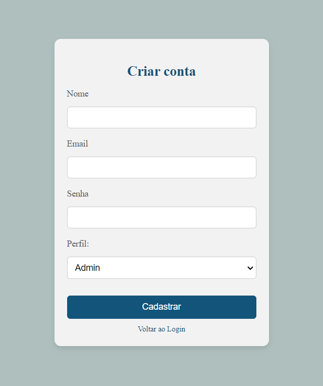
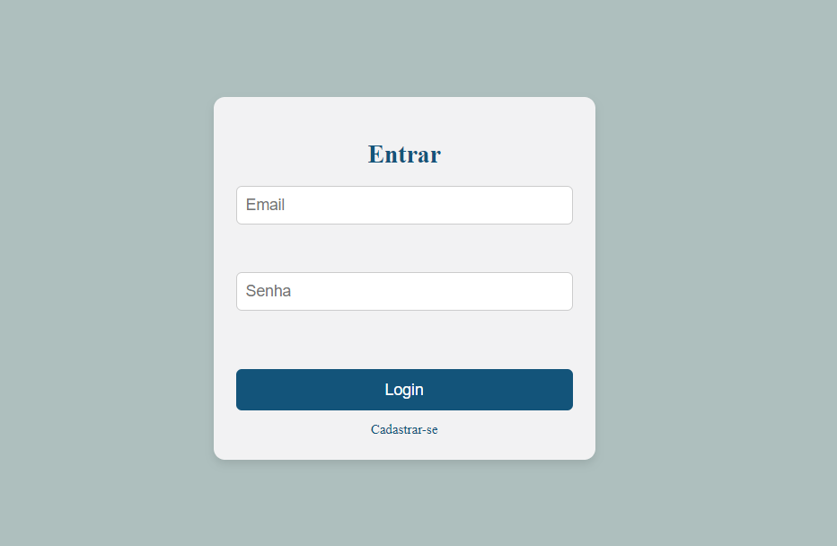
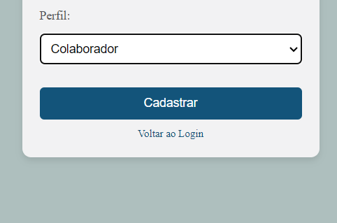

# 🌐 Cadlog System

**Cadlog System** é um sistema de cadastro e login desenvolvido em PHP utilizando a arquitetura **MVC** (Model-View-Controller). Este sistema visa facilitar a criação, autenticação e gerenciamento de usuários de forma segura e eficiente.

---

## 🏛️ Arquitetura

O sistema segue a arquitetura **MVC**, dividindo a aplicação em três componentes principais:

- **Model**: Responsável pela manipulação dos dados, conectando-se ao banco de dados.
- **View**: Apresenta as interfaces para interação do usuário.
- **Controller**: Media as requisições entre a View e o Model, processando as ações do usuário e atualizando os dados.

---

## ⚙️ Funcionalidades

O **Cadlog System** oferece as seguintes funcionalidades:

- **Cadastro de usuários**  
  Permite que novos usuários se registrem no sistema.  
  

- **Login e logout**  
  Usuários podem acessar suas contas com credenciais válidas e encerrar suas sessões de forma segura.  
  

- **Gerenciamento de Sessões**  
  As sessões dos usuários são gerenciadas para garantir segurança e personalização.
    

- **Banco de Dados Integrado**  
  Um banco de dados MySQL é utilizado para armazenar as informações dos usuários, com o arquivo de configuração `database.sql`.

---

## 🛠️ Tecnologias Utilizadas

- **PHP**: Linguagem utilizada para o desenvolvimento do backend.
- **MySQL**: Banco de dados responsável pelo armazenamento das informações.
- **HTML/CSS**: Linguagens para a criação das interfaces do usuário (Views).

---

## ✍️ Feito por

- **Larissa Manrique**
- **Com instruções de** Leonardo Rocha
